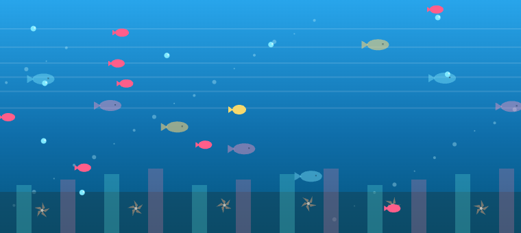
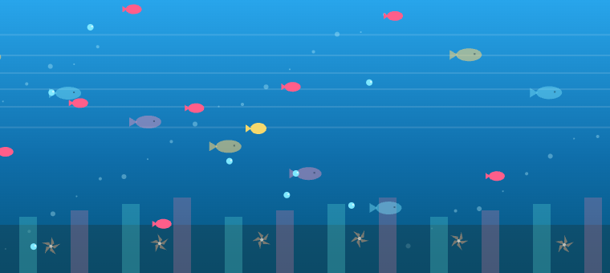

# Beneath the Surface Arcade

A browser arcade game with six modes, animated bot teammate chat, and dynamic audio (background music + event SFX).

## Modes

- 🌊 Into the Deep: dive race with hazards, pearls, and dash timing.
- 😃 Emotion Mask: balance visible calm against hidden pressure.
- ⛏️ Beneath the Dirt: dig layers, collect relics, and surface truths.
- 🪞 Mirror World: move through mirrored space and avoid hidden traps.
- 🔱 Trident Duel: turn-based projectile duel with wind and HP.
- 💬 Read Between the Lines: text-only conversation where tone affects outcomes.

## Controls

- Mode-specific buttons appear under the main canvas.
- Movement modes support arrow keys and `WASD`.
- Trident Duel uses mouse drag-and-release to aim and throw.
- Chat input is available in every mode.
- `Sea Music` toggles background music.
- `Fullscreen` toggles immersive view.

## Audio Layout

- Background music: `assets/music/`
  - `mii-channel-music.mp3`
  - `the-entertainer-fuk.mp3`
- Menu/home playlist: `assets/music/menu/`
  - `through-sea-cc0.ogg`
  - `ocean-trance-cc0.ogg`
- Sound effects: `assets/sfx/`
  - `nothing-beats-a-jet2-holiday.mp3` (victory)
  - `wait-wait-wait-what-the-hell.mp3` (chaos)
  - `spongebob-fail.mp3` (fail)

The game prefers file-based background music and falls back to synth sequencing if media playback is unavailable.
Menu music rotates on the home screen and pauses when you enter a game mode.

## Run Locally

```bash
python3 -m http.server 4173
```

Open: `http://127.0.0.1:4173/index.html`

## Screenshots

### Gameplay 1



### Gameplay 2


